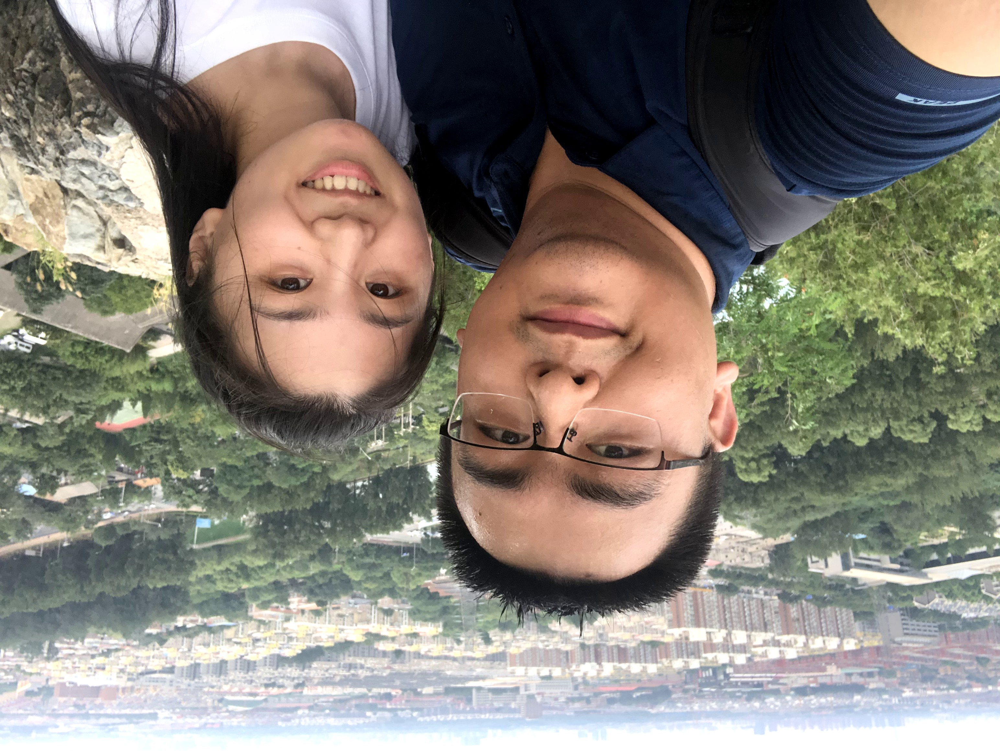

# 2021/11/02

很久没坐早上的班车，上次乘坐还是8月18日，一切都还没发生之前，那时候班车基本都是8点10分左右就能到公司，所以在路上只要稍微多玩两分钟手机，就连睡觉的时间都没有就到公司了。今天班车八点四十才到南门，最近雾霾都很重，整个北京被压得喘不过气来。

沿着阔别数个月的小径往办公楼走的时候，我突然感觉到好像整个人掉到了什么里似的，就像被一片稀软的沼泽包裹，而这些泥浆就是所有的回忆和思念。我抬着头加快脚步，想控制住眼泪不要往下流，但是徒劳无功，揪心的痛楚令我窒息。一路上暗黄色的枯叶遍地都是，一阵寒风吹来，所有的树都发出瑟瑟的悲鸣。我把眼镜取下来捏在手上，索性放肆的哭好了，脚步也逐渐慢了下来。

到楼下的时候是这种情绪最为激烈的时刻，因为曾经每个坐班车的早上，走到这里意味着要去工作了，会让人情绪低落。那时候孙可每天都在家等我，一想到孙可我就又开心起来，重振一天工作的心情，然后先去厕所，把一路上的见闻无论有趣无趣全都发送给她，等她起床之后就能看到。现在我彻底失去了她，我甚至都不敢给她发一条微信。打开她的朋友圈，一条突兀的横条出现在眼前，仿佛是一道锋利的斩断过去的剑。

中午游泳回来的路上从来都是最难熬的时候，但是至少路上还可以大声去哭。回到办公室躺在她给我买的午休床上，只能让眼泪悄悄的流下去。她把我所有的社交账号都屏蔽了，但是我还是看到了她发在微博上的交友信息，看到的瞬间我一下子怔住了，大脑一片空白，过去的所有回忆和感情就像流水一样湍泳而过，从百尺高空奔流而下狠狠地拍打在我的心上。等我回过神已经好一阵过去了，眼泪又不争气的流下来。我真的好痛苦，我要控制不住自己了，虽然我明白这一切都是我活该，我应该受着，她无论说什么做什么我都不应该干涉，但是我真的好想和她说说话，哪怕只是听听她的声音，

我是个懦夫，我是个蛆虫，难道我就要永远畏缩在角落里等一切都过去而不敢面对吗，我不是这样的人啊，我应该变好应该成长啊，我真的了解自己吗，我知道我是什么样的人，做了什么样的事吗，再不改变的话，那我活着还有什么意义，我生命中最重要的东西都被抽走了，还是被我自己抽走的，我到底做了什么啊！

___2020年 8月 8日去北研附近的百望山爬山___

