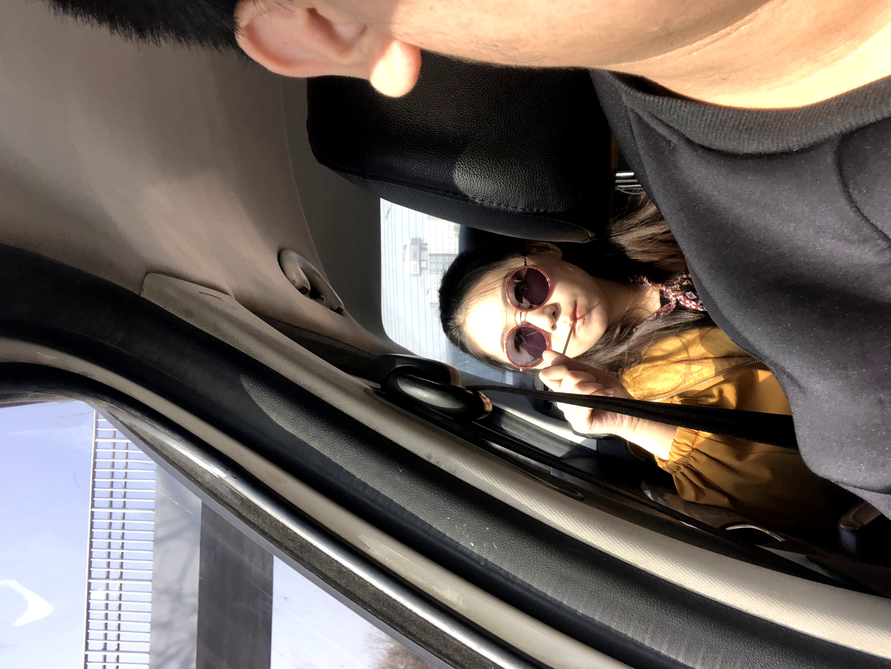

# 2021/11/03

昨天晚上最终还是没能忍住给孙可打了电话过去，我以为她已经将我的手机拉黑打不通，或者打过去她会不接或者直接挂掉，我想象了一万种孙可的情绪，暴怒、蔑视、嘲笑、辱骂，都是我应得的，我害怕这些情绪，但是无论什么和不联系她的痛苦相比，都显得那么不值一提。

漫长的滴声之后，没想到她的情绪如此的平静，就像是一滩深山中的湖水，平静而深邃，我却变得语无伦次。我也不知道自己说了些什么，心却一直在砰砰跳，听到她说她找了个女朋友，我努力的假装平静，说我能猜到，但是我明明就知道，这种时候的感情最容易趁虚而入，只是我没法阻拦，也没有阻拦的立场。等挂掉电话，我又难过又开心，开心在刚刚电话期间她的心短暂的属于了我，难过在我曾经拥有过那么炽热的爱意，却自己把一切都熄灭了，她最后说她要去陪女朋友，我却感觉自己的灵魂都被抽离。

电话中说今晚我去帮她装路由器，她没有拒绝，这是我近来最开心的事情。今天一天的工作和晚上去见她相比显得如此冗余而漫长，今天游泳回去的路上也是少有的没有掉眼泪，但是还是好冷。

最近工作逐渐又变得繁忙起来，CEAE的维护工作彻底的落在了我的头上，白天的工作让我觉得自己就像一个皮条客，每天接待着不同的一线给组里的开发，不停的交流和说话让我身心俱疲。一下班车我就直接退出了手机WeLink，不让任何人找到我。打开自行车的锁，我希望下一秒就到孙可的旁边，骑上车却看到并行的自行车上插满各式的冰糖葫芦，我想孙可一定会喜欢的，我叫住了那个满头白发的大爷，买了两串冰糖葫芦，回去的路上想看看还有没有驴打滚，但是好像还是没出摊。

在家找到她需要的东西，我买了串串和饮料给她，打车来到楼下。她说要睡会等我到了给她打电话，下了电梯，我本来想走到窗前敲敲窗子，就不打电话了。但是手放在窗前犹豫了半晌，还是走回到门前，拨通了她的电话。

她的脸，那么熟悉，她的表情，却那么陌生。看到她的瞬间，我的心就好像被她捏在了手里，无法控制自己的感情，眼泪马上就要涌出来，我只能继续带着口罩，努力保持。装路由器、调试网络、吃东西、聊天，她一直想告诉我她新女朋友的事情，那种表情一如我曾见过的那样热烈和充满爱意，但是似乎有点坦然和无所谓，我知道这都是我留下的伤口，这一切都是我活该。

想象中可能会让她有点打动的从口袋里掏出AD钙奶的动作她似乎完全没有在意，反而是雪碧和奶先后撒了她一桌子和一床，给了我给她拖地的机会，她无处不在的防备和距离感仿佛要将我的心撕裂，一片一片落在地上。该走了，但是我却控制不住自己，只想颓然的坐在地上看着她。

最后的离开既不潇洒也不美好，我这次的表现既不成熟也没成长，我都不知道自己在做什么，回家的路上，我在车上嚎啕大哭，我想，也许就这样，她一步一步走远，一点一点放下了吧。

___2019年 3月 26日去朝阳法庭立案___