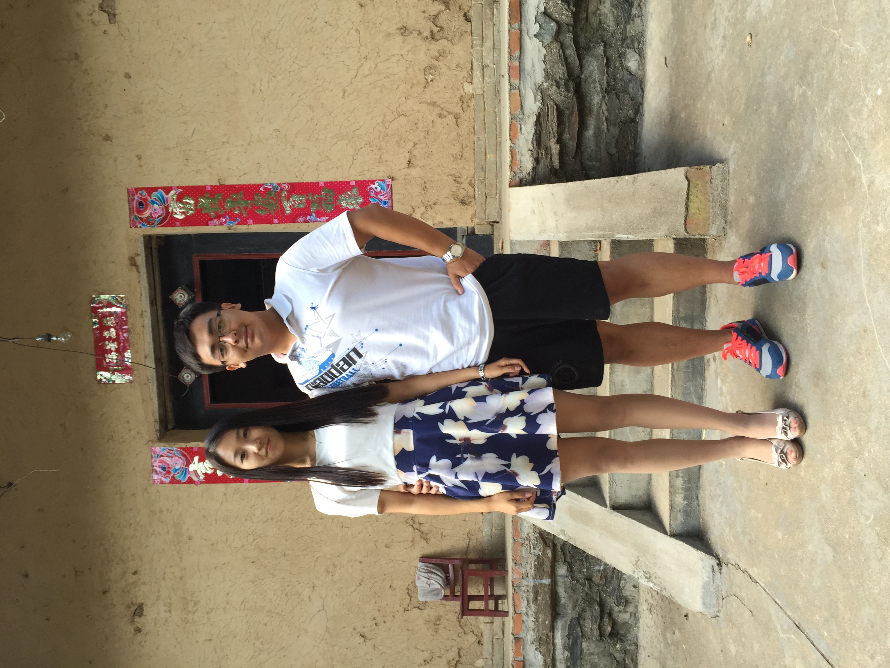

# 2021/11/05

今天是周五，而且是一个周六周日没有加班计划的周五，但是我好像从来没有这么不喜欢过周五。因为周五的到来意味着，我要一个人去面对周六周日，一个完全没有孙可在的周六周日。

今天的工作很辛苦，但是我处理的很快，时间一秒秒的过去，越来越接近下班的时间，我总觉得身体在不停的打颤，我也不知道自己害怕什么，但是我有很清楚自己在害怕什么。

今天没有坐班车，骑车坐地铁回家，从前坐地铁的理由都是回家时间短时间可控，可以和孙可一起早点回去陪她，但是今天的理由是这样可以把单车停在地铁站，这样明天就可以过来加班，是的我打算来加班，因为我不知道怎么在这个房间熬过失去孙可的24小时，就像是一场酷刑。

今天地铁上人很多，很拥挤，我突然不知道如果没有孙可，我为什么要经历这个，如果没有孙可，那我早一秒晚一秒回去又有什么区别呢？

今天做了好多梦，全部都和孙可有关，我梦到我和她一起玩一个叫《昏暗森林》的游戏，是我们两个一起解密从一个太空舱逃离的故事，太空舱昏暗而空旷，还好有她和我一起，我们一起逃离，但是恍惚一瞬间我们又闪入一个昏暗的森林之中，她突然消失了。从游戏中出来，她就坐在我旁边，还是那个熟悉而温暖的笑容。和煦的阳光下我们俩坐在街边小店的长板凳上，一如在校园里，她拿着一个优雅的翻盖手机，转头对我笑了一下，我看到她手机屏保上的那一行：我们一定会有以后。

今天我从梦中醒来，身边没有她的温度和气息，眼睛被泪水涌开。

___2015年 9月 1日在陕西北宽坪老家___

