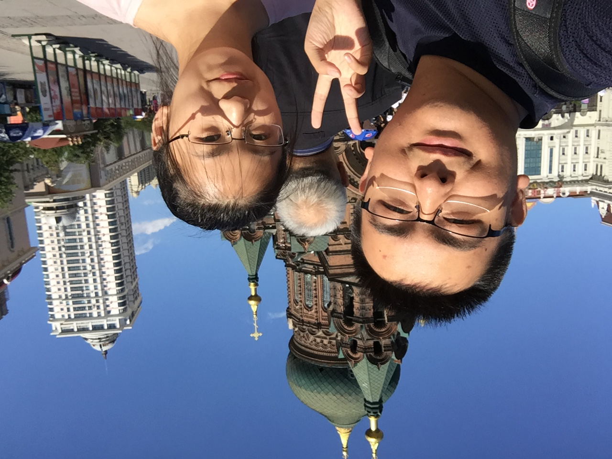

# 2021/11/06

雾，大雾，浓厚的大雾。

拉开窗帘，依然没有一缕阳光可以挣扎进房间，我呆坐在床边，静静的盯着浓雾，就像想从浓雾里看出些什么。

收拾好房间，骑车去地铁站，雨很凉，我却慢慢踩着踏板，任由水滴慢慢从脸颊滑下。地铁上人很少，我木然的靠在座椅上。突然电话响起，本来以为又是推销电话，拿起手机一看，竟然是孙可，我一下子没有反应过来，但是立刻接起电话，电话那头传来她熟悉而冷漠的声音。她本以为我今天不加班在家，她说她想和我彻底分手，彻底一点，所以她本来打算把电动车给我送过来。地铁的声音震耳欲聋，她并不能听的清我的声音，只好先作罢，等我下地铁再打给她。

放下手机，我愣了半天，我明白她的意思，但是我真的没法接受，因为我现在就像站在浓雾之中，我不知道要做什么，我不知道要去哪里，但是我只是知道，挽回她一定没错。她就像一个灯塔，光亮刺破所有的阻碍，让我还知道方向。平静了自己的情绪，下了地铁，我给她打了过去，信号还是不好，雨愈加冰冷，我们便约好等我到公司再说。等到了公司，我又打了过去，我们聊了很多，但是我没有办法，即使是不破不立，但是我也不能付出彻底和她断绝联系的代价。

随后我去加班，处理了工作，然后迅速回家，在地铁上我告诉她，我不能接受这样的线上彻底分手，至少我们见一面。这我才知道她是在烦恼明天的家教，我说我愿意帮她处理，本以为她会拒绝，没想到她竟同意了。我对她还是比较理解，很多事情她自己执行的可以很好，但是很难去订好一个框架，也很难下决心开始，尤其这个还是一个她不擅长的教授的工作。

下了地铁，雨已经夹杂着冰渣，回到家浑身已经湿透了。打开电脑，我们俩连着腾讯会议，她开心的告诉我女朋友刚刚给她送了吃的过去，我一时语塞。我像以前处理孙可所有处理不了的问题一样，带领着孙可的思路，一点一点的将问题瓦解，一点点处理，那几个小时仿佛回到了以前。

休息的时候，我放着木子旭的歌声，看着窗外，窗子上一滴滴雨水已经被冻成冰珠，紧紧的贴着窗子，远远看去好像一块块污渍，我给她点了一杯热奶茶。最终定稿之后，她要去睡了，我请求她不挂腾讯会议，让我感觉她还在我身边，她竟然没有拒绝，我一边听着她睡觉的声音，一边处理了重庆电信T&D升级的问题，然后伴着她一起睡去。

从前无数个夜晚我们同床共枕，我忽视了枕边人，现在隔着屏幕，却想紧紧与她相拥，长眠不醒。

___2017年 9月 6日于哈尔滨圣索菲亚大教堂___