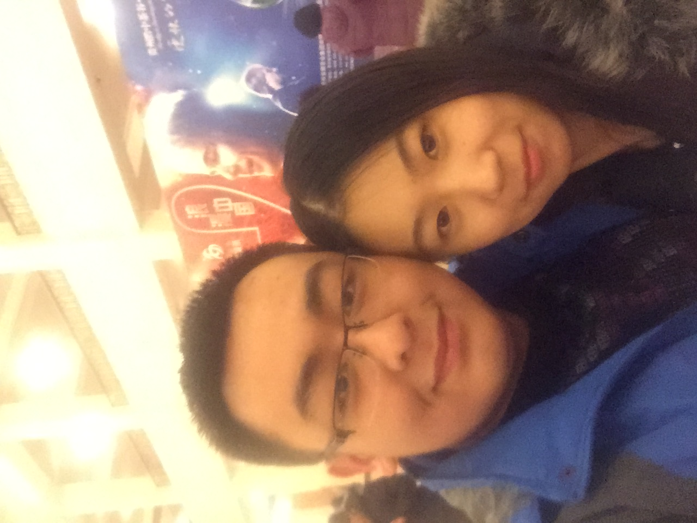

# 2021/11/07

八点钟我突然醒来，虽然隔着屏幕，但是她的存在让我睡的无比踏实。拉开窗帘，整个北京被大雪覆盖，美丽的初雪，纯净而绝美，远方的天空空旷而纯净。站在床边，我把窗子打开了一道缝，冷风呼啸而入，但是那种包含雪意的潮湿的空气，我却努力的大口吸入，仿佛一个被关在逼仄的囚牢的犯人，从窗口努力的品尝每一口新鲜的自由。

她醒了，我们躺在床上聊了很多，虽然是各自在各自的床上，但是一如我们每次谈心，我们无所不说，只是这次聊了更多以前不会说的。她认为无论如何，她想享受这次恋爱，和这个女生，她觉得对我已经没什么感情的感觉，只剩下亲人的留恋。所以她希望可以彻底走出来，一直保持现在这种状态她是走不出来的。她觉得我好像还是长不大想不清楚，很多事情还是不明白，也不知道自己该做什么，她不忍心看我这样，她认为如果没有她我还是很难变好，所以她很难过。

我也不知道回答什么，我想变好，我想了很多事，我的行为，我该做什么，我应该做什么改变。但是好像就像她所说，都很浅，还是很幼稚。所以她给我说了一点——和人之间的相处和做事应该随时去想，所做的事或者所说的话，是否和我想和这个人达成的目标一致？我以前做事的时候总是只图当前自己的感受，从来没有想过我的目标是什么，这就是一种巨婴心态。是呀，无论和任何一个人的相处，都应该是有目标有方向的，更何况是和爱人，所做所说的一切都应该是为了维护两个人之间的感情，为了以后更好的在一起，是为了让两个人开心。

她说的这个道理好像非常简单，但是却让我觉得醍醐灌顶。我一瞬间反思了我所有的行为，从8月开始我所有的行为不就是这样？做事说话完全不考虑目的，才这样一次次的把事情变得越来越差。初次之外，由此类推还能明白，就是对他人的行为和言语，也要不断的去想他人的目的，像我这样没有目的的人少之又少，只有努力的去思考推断别人的含义，才能更好的与人相处。

聊了整整一早上之后，我帮她把教学的最后内容处理完，给她点了早餐，然后她挂了会议去上课了。突然我好像又被掏空了似的，变得失魂落魄，我早都失去了孙可，但是昨天到今天这短暂的相处，好像又重获了她，然后又失去了。我颓然的在床上躺了很久。

等她下课，她变得自信了，本来打算上完这节课就不再上了，但是看来我的帮助让她又重新相信了自己，我会抓住这个机会，好好再陪陪她的。晚上她的女朋友就去找她了，果然等她回去，所有的信息都没有回复了。

窗外天已经暗了下来，昏黄的路灯下，马路上的雪已经消融了，黑色的地面上，一辆辆汽车反射着人造的光芒。

只有屋顶上，好像还是早上的光景，什么都没变似的。

___2015年 12月 25日人民大会堂听理查德克莱德曼演奏会___