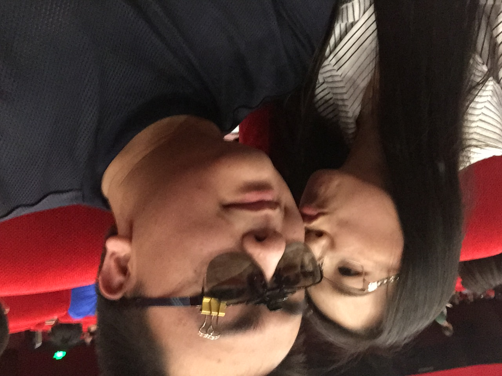

# 2021/11/08

珍惜，到底是什么？

近来我很喜欢一件蓝黑相间的尼龙外套，因为他很宽松，很舒服，但是同时又很暖和，大大的口袋，可以装下所有的东西，我对它爱不释手。唯一的问题是，它帽子的松紧带不知为什么是断的。

今天来到公司，坐在办公椅上，我抻开双臂，任这件我喜欢的外套从身上滑下，它的袖子和帽子就卡在椅背上，而身体部分却塞在椅背和座位的缝隙处，我再没给它多一秒去把它挂好，而是立刻打开工作电脑。

工作告一段落，结束会议，我站起来伸了个懒腰，将靠背下放的锁打开，随后一屁股坐下去，身体自然的向后仰过去。“嘶啦”，我听到布料扯破的声音。完蛋了，我心想，肯定是那件外套。我连忙站起身，发现外套的身体部分不知什么时候被我蹭到屁股下，而袖子和帽子还卡在椅背上。所以当我坐在衣服上向后一靠，袖子顶部便直接被扯开了。

我心疼的看着那个口子，突然，我明白了，它的松紧带为什么是断的。

我似乎从来不知道什么是珍惜。小时候爸爸买给我的足球，我无比喜欢，却在第一次拿出去玩的时候，把它落在操场忘了带回来；后来爸爸又给我买了遥控船，第一次我就把它放在湍急的河里，螺旋桨狠狠的撞在石头上，它再也没能启动过；喜欢的裤子，穿的最多，但是从来不熨不叠，穿一次少一次；喜欢的鞋，都是白鞋，从来不会自己去擦洗，越来越破，越来越脏，直到有天不知道它怎么就消失了；从人生中第一个手机，到孙可给我买的iPhone 11，不是屏幕碎就是边框不成形状，话筒没声，主板进水。

难道，我真的不喜欢吗？这些喜欢是假的吗？可是那个足球带给我的快乐，那艘船给我带来的惊喜，我到现在也忘不掉，还忘不掉的，是失去它们的后悔和自责。

没有珍惜的喜欢，是一种不配，说明所喜欢的，注定会被毁坏、丢失、伤害、离开。一个不懂珍惜的人，什么都不配拥有。

虽然很晚了，我已经失去生命中最重要的事情，但是我终于明白了，珍惜。

我希望还有机会，从所有的小事做起，珍惜，珍重！

___2016年 6月 8日在金鸡百花影院看魔兽世界___