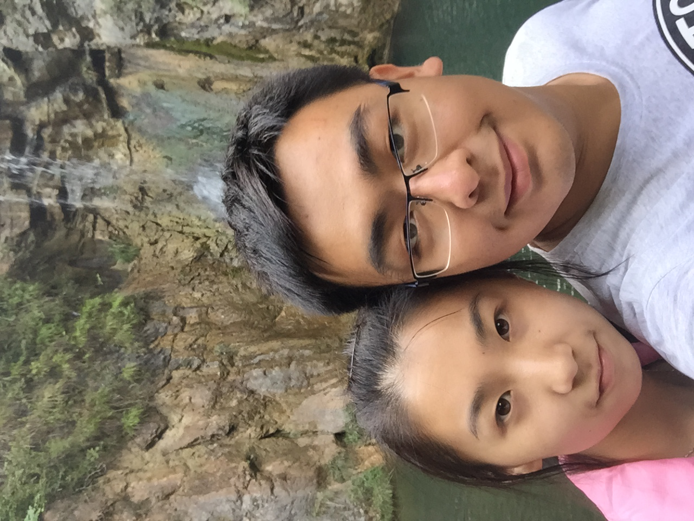

# 2021/11/09

昨晚在回家的班车上，突然收到了孙可的，那边泣不成声，原来是和妈妈吵了一架，却觉得无人倾诉。我陪她聊了很久，等她情绪缓过来之后我才上楼。她说的话我印象最深的一句是，每个人都过得好艰难，而你，让每个人都过得更艰难了。

对于我父母，她父母，她以及我来说，确实是这样的，大家都很艰难，但是至少曾经，大家都会觉得生活会变得越来越好。但是我所做的事，却让所有人的生活变得无比艰难。今天无论是她父母还是我父母都查出来一些会持续影响晚年生活质量的疾病，他们年龄越来越大了。

对孙可来说，她什么都没有做错，或许我可以找出来一万个她在感情或者生活中的不是，但是曾经的她对我无比信任，对于我们的未来也充满了想象。她只是想要一份热情、真挚、稳定的爱情和家庭而已，我却连最基础的尊重都没能给她，每当想到她一个人的悲伤与哭泣，我都仿佛看到她坐在房间的角落无助的样子，眼中没有一丁点光芒，我的所作所为磨灭了她对所有美好的向往。我真的是个混蛋，我的成长是以孙可作为代价的吗？

今天晚上约好去她家给她整理线以及带过去褥子，我早早回家洗了个澡骑车过去。风很大，我好像无论向哪个方向都是在逆着风前行。她变得更美了，但是似乎也变得更陌生，我和她之间好像有一个不可跨越的距离，甚至她的眼神都会让我觉得深深地自责与内疚，我不敢直视她，甚至不知道说些什么。我坐在地上帮她把线收拾整齐，床铺好，她变得很开心，那种开心让我更加痛苦，因为曾经这种开心只要她见到我听到我就会有，而我现在却折磨得她至此。

我本来有很多想给她说的，想说今天中午和鹏志一起吃饭然后散步，说刘筱要去做产品管理，说超然要离职了，说我也想转岗因为华为还是一个2B很强的企业，而不是软件技术，想说自己的生活，想说游泳，想说吃饭，但是话到嘴边却不知怎么说出口，我好像，不再有资格让我的生活琐事再这样侵袭她的生命。

帮她例行拖完地，我让她坐在床上不用下来了，带着自己的东西和垃圾，我又踩着北京的狂风上路。十点的街道上车还是很多，她说可以把我当工具人，但愿我再能多陪陪她。

___2015年 8月 29日于陕西商南金丝峡___