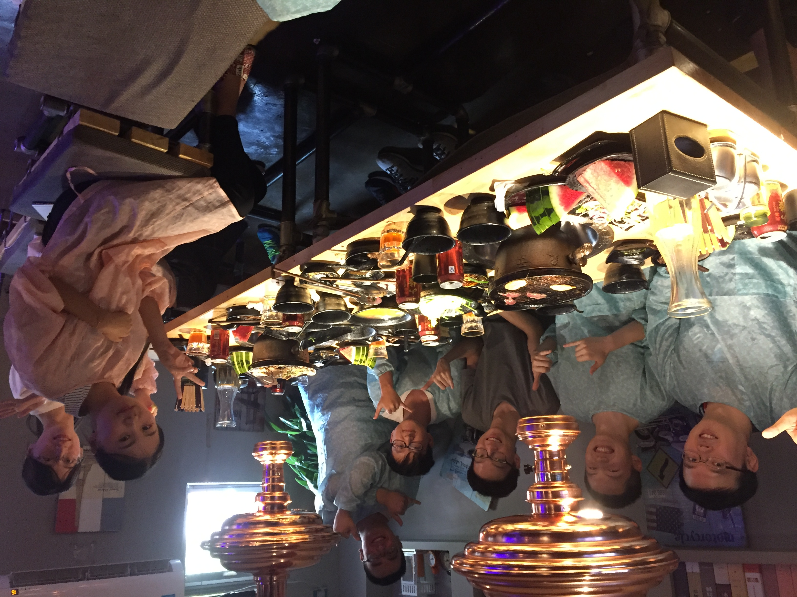

# 2021/11/12

浙江移动、联通集团、河南5GC……最近这些名词变成我最大苦痛的来源，虽然这些压力让我进步很快，但是一个接一个的也让我疲于应对，应接不暇。

工作的意义是什么呢？当然工作最基础的意义是为了赚钱养活自己，最顶层的意义是为社会生产力进步作出自己的贡献。但是当这些浅显但又深奥的道理慢慢浸入生活中之后呢？今天浙江移动有一个衍生未进行的问题，让我和具成都非常苦恼，我一边支撑意大利的局点升级，一边收到客户所说的今天不解决就要管理升级的威胁，格外头大。

处理完意大利的问题，我站在具成背后看他定位这个疑难杂症，突然，我想知道工作对他来说的意义。具成研究生毕业已经三年多了，三年都在同一个部门，兢兢业业的做开发。他女朋友现在还在澳门读博士，还要三年才能毕业，他住在公司的公租房，大概在环保园北边七八公里的位置。不同于我，工作之于他，更像是生活，他像是在工作的间隙生活，与他一起在杭州的两周，他只要醒着基本就在工作。工作对他的意义是什么呢？他是在工作中寻找生活和自己的价值与意义吗？他在工作中成长，在工作中生活，在工作中努力，在工作中等待，等待自己的女朋友来找他，一切如此平淡又按部就班，但是这种平淡中却是一种坚持的伟大，对公司来说，他是可以依赖的强力开发，对于我来说，他是认真做好表率的师父，对女朋友来说，他是努力用行动实践未来美好生活规划的依靠。

天润，考过了可信考试，但是挂在了性格测试上；鹏志，转了华为，但是对部门的技能现状不满，一心想离开；超然，疲惫的对接问题让他无心从事软件开发，已经找好了下家表明了离职意愿，最近每天都在工作看技术架构视频的他，脸上少有的浮现快乐的神情。

每个人都在生活，都在寻找自己的价值和意义。我曾经从来没有想过这个问题，甚至对于自己要成为什么做成什么都没有认真的去想过，是时候了，无论想要什么，时间都不多了。

___2016年 9月 24日于学校西门栀子花开新实验室聚餐___