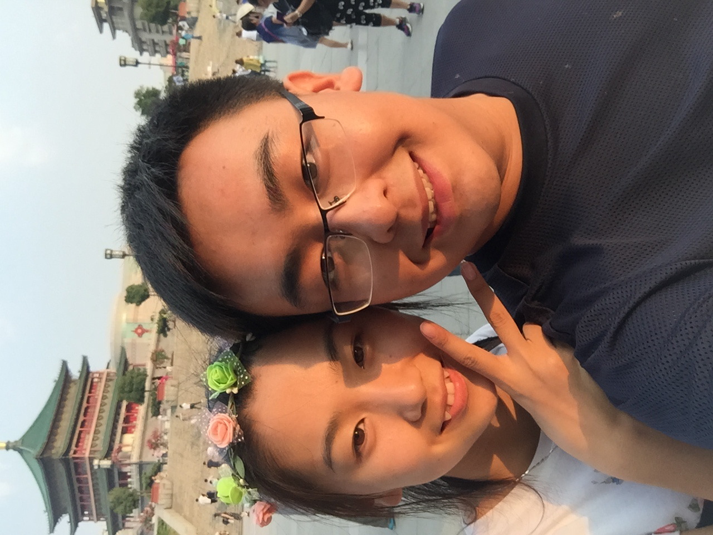

# 2021/11/13

又是一个周末，同样孤独感与痛苦感，在昨晚到今早，就像一波一波的潮水向我袭来。

早上天气还不错，但是躺在床上，完全不知道要做什么，也完全没有什么想做的，所有的娱乐没有孙可好像都失去了意义，也失去了应有的乐趣，只剩睡觉，以及躺在床上听听音乐。

我一直觉得自己对音乐有不同于其他人的依赖感，因为我的大脑似乎是不可以放空的，除非我在非常认真的做一件事情的时候，剩下的时间大脑至少需要音乐的陪伴。曾经除了音乐，还有随时可以打给电话陪伴的人，孙可，所以那时候音乐虽然重要，但是更像是穿插在生活中的调剂品。而现在，音乐却变成了生活的主旋律，过去的这一周除了和具成、鹏志、刘筱、练练当面说过话以外，剩下的全部都是通过电流联系，无论是父母还是其他同事。就连上周宇豪过生日，我都没能给他打个电话，他也因为在准备考试我们俩没能好好聊聊天，甚至这段时间我们俩都没能见上一面。

所以现在音乐对我来说就像是一个灵魂，一个随时还能让我觉得慰藉的灵魂，一个让我不那么孤独不觉得世界上只有我一个人陪伴。我明明很讨厌这种感觉，我明明从小就是一个无法停止沟通交流社交的人，我怎么真的就活成了自己最不想成为最讨厌的样子。

周末好像只能用加班熬过去，一路上满是枯叶，我骑着车从它们身上碾过去发出沙沙的声音，抬起头看，这条路仿佛都满是是她的身影。

就像孙可所说的，我和她，不可能真的从记忆中逃离，因为我们俩本身就是记忆，所有的音乐，所有的场景，所有的时间，都镌刻上了，她的名字。

___2015年 8月 26日于西安鼓楼前___

