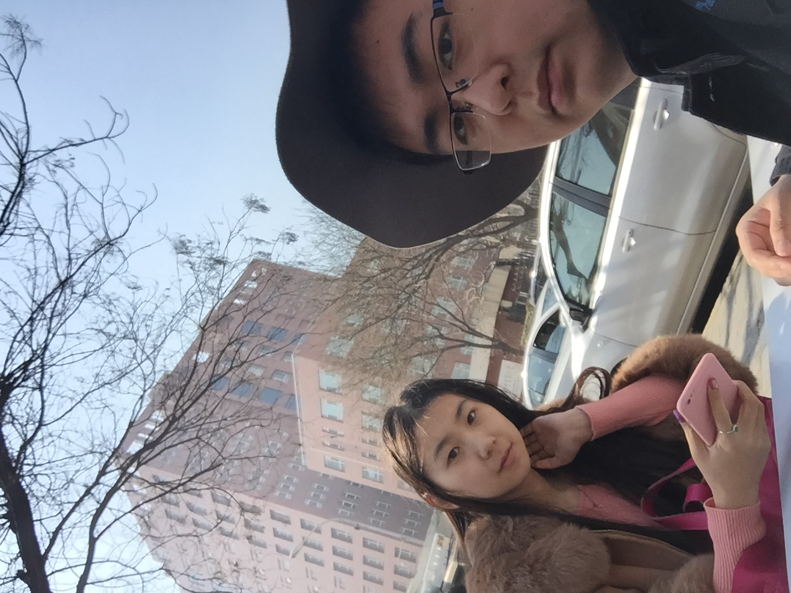

# 2021/11/14

又是一次在梦中，感受到失去她。

梦中的难过和痛苦从来都比现实还真切，就像一把把刀直接扎进心脏，每每在梦中我都能哭到喘不上气。而醒来的瞬间这种痛苦就会直接嫁接到现实，让我继续在床上捂着胸口痛哭。

早上帮她准备课件，帮她理顺了假设检验的各种分布和检验，这也是少有的现在我能帮她做的，只要和她交流交流就会让我觉得满足。在和她交流的时候，她埋怨说我没有考虑那个女生的接受程度，我只考虑事，不考虑人。

这句话让我印象很深，帮她做完，我骑车去三里屯的苹果专售店，一路上我都在仔细想孙可说的这句话。突然我觉得，我是一个不怕事、敢做事、有拼劲的人，但是只是对事而已，只要涉及到人我总是做不好，但是这世界上的事情，除了学习以外还是什么事与人无关？想起来军训的时候，我作为大班，我只对事，我想把事情做好，觉得好像把事情做好的话别人就能看到，就能认可我。但是实际上就是我确实把事情做好了，但是最终却让别人讨厌我。所有的事情，都是和人相关的，这世界上的事情，离了人就没有意义了，诚然对待事情还是要认真努力，不怕事去把事情及时做好，但是同样的，如何处理这件事相关的人，怎么处理和这些人的关系，而且有些事情还会关系到别人的利益，如何把利益用大家信服的方式分配，这些事情往往会比事情本身做的好与不好更加重要。就像打王者荣耀排位开黑的时候，胜利确实很重要，但是相比于胜利，和愿意一起开黑的朋友玩的开心，让大家觉得舒适是比胜利更重要的事情，那么这种时候就应该注意别人的情绪，又不是在打职业比赛。

我要学的事情还有很多，我确实应该接受社会的毒打，在程序员这个岗位我是不会经历这些的，只有变化才可以。但是无论如何，我都要尽一切努力，我绝不会放弃的，是和孙可的感情。没有这个，我也什么都不是。

___2016年 3月 14日于学校西门吃早餐___