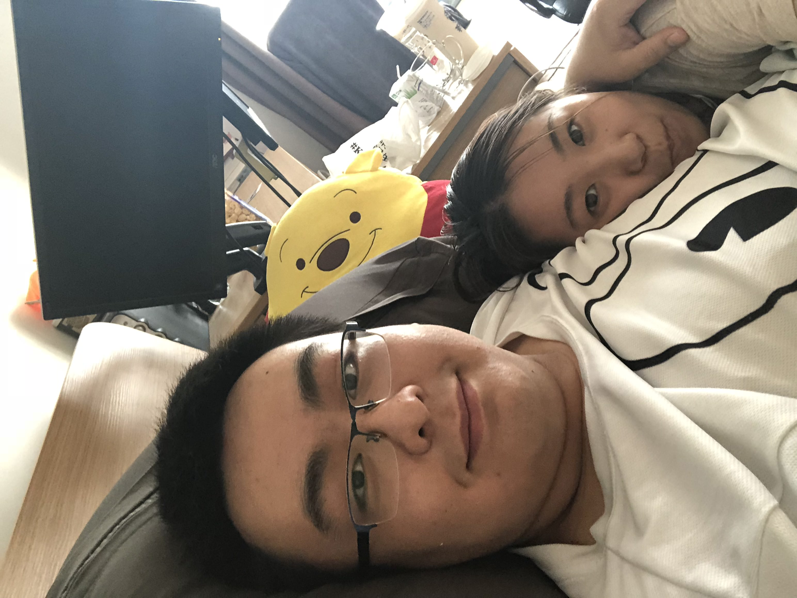

# 2021/11/16

昨天孙可说的话今天继续思考了一天，她确实说的很对，因为我们现在的纠缠没有任何意义，除了让她觉得痛苦不舍，让我觉得难过可怜以外没有任何用，虽然很难去接受，但是确实是不破不立。

今天下班的时候给妈妈打了电话，妈妈说我十一回家的时候她觉得我失去了从前自信从容的样子，她能理解是因为我之前做的错事让我自己也觉得自己抬不起头，甚至是连阿姨都注意到了我现在有点畏畏缩缩的样子。我明白这是错的，不对的，不应该的，因为无论如何，无论是谁，都不想看到一个畏缩懦弱的我，所有人对我的好感和印象都来自一种阳光的自信，我应该成为别人生活里的阳光，而不是想让别人的阳光来温暖我。

我做了很多错事，还有很多我不理解的事情，但是既然做了就要敢作敢当，人终究还是要活着，不仅仅是为了别人，更是为了自己，只有自己发光才是最靠谱的事情。

好在还有机会，虽然很晚，但是也没那么晚，人生遑遑已过快三十余载，但是我好像从未像现在一样这样清醒的活着，明白自己该做什么。迷茫吗？迷茫，但是也不迷茫，因为没有退路，就像公司总说的，没有退路就是胜利之路。

我想我还是会一直爱着孙可，会一直想着她，会在所有的间隙想起她的一点一滴，但是我也会记着，她想要的是一个身披金甲圣衣、脚踏七彩祥云还依然爱他的至尊宝，而不是孙悟空。

___2018年 8月 9日于银枫家园在腿断期间___