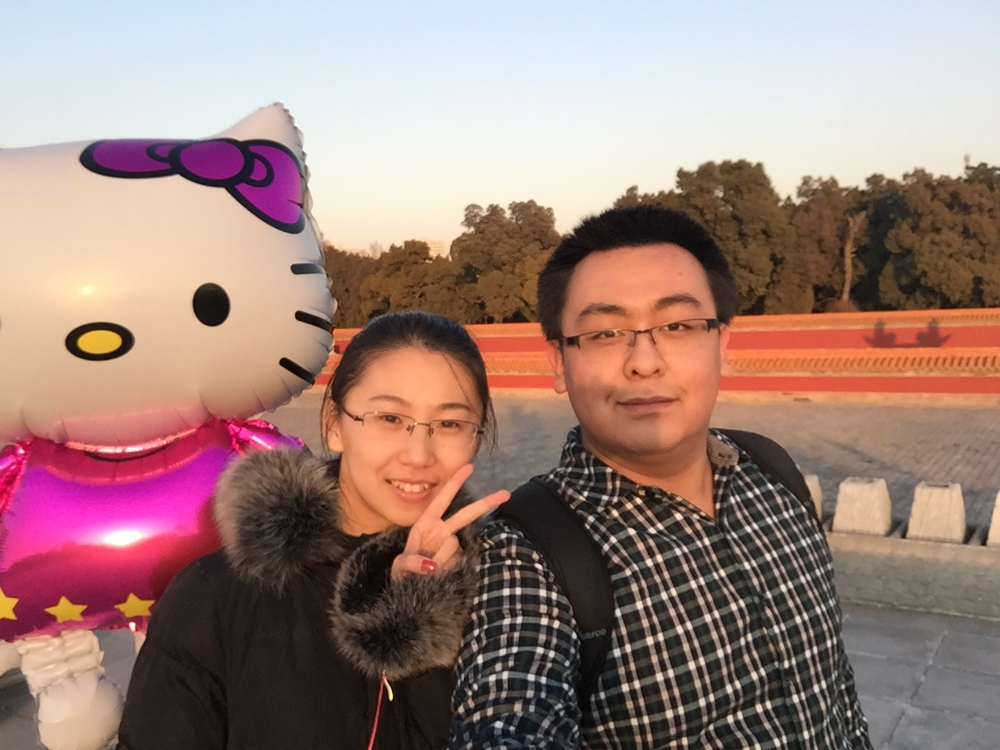

# 2021/11/17

虽然我知道，在前两天听孙可说的那些之后，我应该好好振作好好去努力，不应该再难过可怜，但是当我被闹钟在六点半的漆黑中叫醒的时候，无处可躲的黑暗，都让我想起来每次起床身旁轻柔的喘息声。

去年冬天，也是我刚刚上班半年，每天也是六点半起床去赶班车。银枫家园我们的房间很小，只有一个卧室，怕吵醒孙可，我就用手机打着光，找到衣服和书包，偷偷地溜出去，生怕吵到她休息。但是冬天早上的六点半真的是一丁点光线都没有，每天早上起来找东西都让我觉得抓狂。后来孙可就让我起来之后打开小灯，这样会方便一点。

那时候孙可总是埋怨，她一睡醒旁边就没有人了，只剩她自己一个，好难过。所以她一醒来就会给我发微信，经常给我发一大段自己做了什么什么样的梦，难过或者开心。我在上班路上也会把所有碰到的琐事都分享给她，等她醒来之后回复。那个时候我从来不担心自己发的太多打扰了她，因为我知道她一醒来看到一大堆信息的时候会很幸福。后来孙可要求我每天早上走之前抱抱她，她宁愿被吵醒也不想一醒来就看不到我，但是我早上起床时间很紧，二十分钟的时间我要刷牙洗脸上厕所收拾东西加准备早餐，所以当我走的时候总是很急，经常只能给她一个短短的抱抱。如果能穿越的话，我真愿意回到那样的一个普通的早晨，好好地抱抱她。

也许，所谓的日常，才是无常。

夏天快到了的时候，孙可便每天早上送我去车站，晚上来接我，从家里过去车站要骑车15分钟，最开始她二十多分钟才能到，后来越来越熟练，总是闯红灯。我很担心她的安全，但是她每天接送我真的会让我非常开心和满足，因为原本我离开卧室就离开家，回到卧室才到家。但是她送我的话，早上我上车的时候才感觉像离开了家，晚上下车的时候就像回家了。

曾经我们俩是对方的家，不管北京有多大，我们都会觉得，有个家。

___2016年 12月 10日在北京地坛公园郊游___