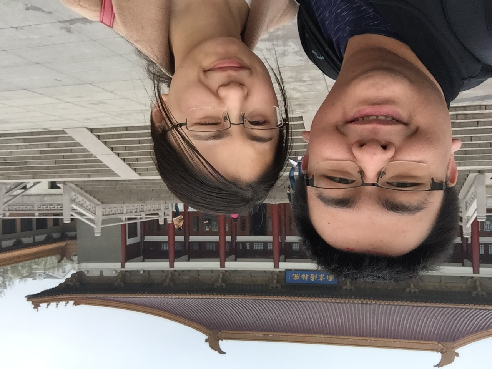

# 2021/11/18

突然明白了一件事，失去目标的分享欲真的是一件极其可怖的东西。

想起来在和孙可分手之后，孙可做的第一件事就是在抖音上把我拉黑，她说抖音是她最重要的分享欲的场所。我其实一直有非常强烈的分享欲，在于孙可在一起的这么多年，所有有趣的事情我一定会找办法保存下来，然后让孙可一个一个看完，感受到我的乐趣，就好像所有有趣的分享只分享给她只要她看到就足够了。

所以在学校的时候，我们去酒店，到后来孙可回家后回北京，我们俩一定会做的事情就是躺在床上一起看我在微博上的转发，我在微博上大概转发过好几千条，我都和她一一看过，经常两个人一看就看到半夜。虽然所有的这些视频都是我已经看过的，但是和她一起再看一遍一点也不会让我觉得无趣，因为第一遍看的时候是在取悦自己，第二遍和她看的时候是在看她。

还有各种政治军事节目，我明白大部分女生对这都是毫无兴趣的，但是孙可总是会迁就我的爱好，一起看我喜欢看的。但是对她喜欢的，比如房屋改造、动漫或者电视剧，我总是毫无兴趣。抖音上总是能看到孙可转发给我的好几百个视频，无不是她希望我一点一点看完的，还记得在东莞的时候我们俩一起远程看抖音，两个人疯狂点喜欢来告诉对方哪里有趣。

其实我有点不明白，成长或者成熟，或者有城府的体现，就是控制住自己的分享欲，放在自己心里吗？我不懂。

后来发现我自己原来很依赖文字，因为我觉得写文章就是一种与自己交流分享的途径，尤其是最近，彻底失去分享欲之后，我强烈的分享欲无处安放，只能不停地写东西来让自己满足。到现在我还记得在东莞的时候我一边泪流满面一边疯狂打字的场景。

我也不明白，为什么，变成了这样。

___2017年 4月 5日于南京博物院门口___