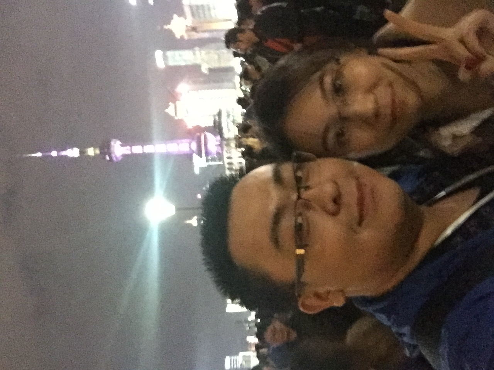

# 2021/11/19

完全控制表达欲真的让人非常难受，有时候我甚至都在想，如果这样控制表达欲的痛苦之后那天不能痛哭着说出来，还有什么意义。

我曾经经常会做一些类似苦行僧的事情，比如还不熟悉骑车的时候就一天骑车一百五十公里，一路上都非常痛苦，但是最终坚持了下来，比如大一的时候想减肥，就整整一个月一口饭都不吃，还有各种各样的不加考虑和思索的冒险，经常给我身体上带来巨大的考验。但是好在我这个人做事的时候确实是有一种勇气和冲劲在里边，所以总是好像结果还不错。一直以来我觉得自己比较适合冲刺性的工作，一段时间可以忙的要命完全不休息，比如大学的时候帮唐轶凡写东西以及自己许诺别人开发软件，都几乎是耗尽了我的所有精力，在那段时间我可以完完全全只集中于这件事。但是在一段时间的冲刺之后需要非常舒适的长时间的休息。这么看起来我适合干辅警，工作二十四个小时，休息两天哈哈哈。

但是这些苦行僧的事情对我来说有个特别的意义就是与他人分享，如果没有分享的乐趣我觉得我根本坚持不下去。甚至打游戏都是这样，打王者荣耀的时候我就很喜欢把自己的觉得精彩的操作在一局打完之后记录下来，然后有时间了就拉着孙可一点一点，分享可以说是我人生中最重要的一部分。

想想这么多年，从小到大，我很少有现在这样的身边完全没有任何朋友的情况，唯一想说话的话只能给爸妈打电话。大概四年级之前，我都对陪伴或者朋友没有什么概念，但是还是有很多玩伴，但是后来我就开始有了一个朋友的概念，而且是一些可以说心里话和其他人完全不同的朋友的概念。对我来说我真的拥有过很多很多的朋友，小学的马晨歌、薛志浩，上初中之后郭旌晨，闵浩迪，孙文博，雷发翔，姬晨，储鑫，王都，任超，上高中后南夷非，李鑫，高可宽，郑威豪，第五苗萌，朱家玏，宋奕辉，叶安丰，大学的孙易生，王弘扬，强宇豪，唐轶凡，毕业之后和我哥住在一起，每天也能说说话。这些人无不在曾经的短则一个月，长则两三年的时间里扮演我所有心声的倾诉者，对我来说这样以心换心的倾诉者是这么重要。

所以现在的感受，好像整个心被掏出去，但是也许，控制自己的表达欲，不向别人倾诉自己的心声，也是成长的一部分吗？Maybe

___2016年 12月 3日参加完冠生园创业比赛在上海外滩___