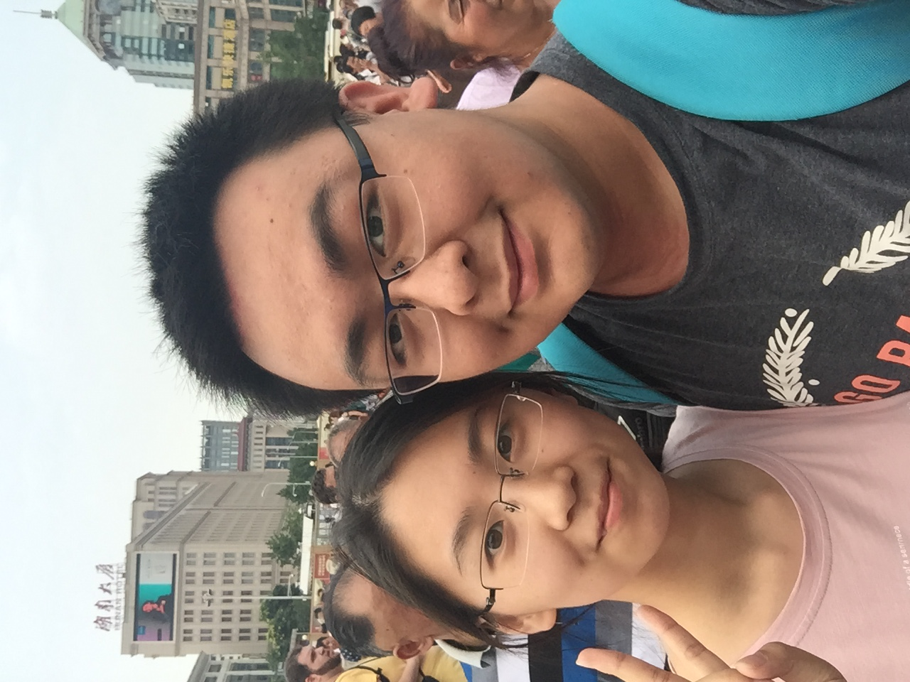

# 2021/11/20

昨晚孙可给我打了电话，骂了我很多，但是我感觉不知道怎么回答，因为对她我道歉的话已经说过太多，多到好像只是一种无意义的堆砌，因为重复的话语没有任何力量。

其实自从她走了之后，我的脑海每天从早到晚都在不断地闪烁着和她相关的想法和言语，还有过去的回忆，开心的不开心的，但是当她打过来的时候或者面对她的时候我却都说不出口，因为我觉得现在的我不配提这些事情。我现在想做的能做的也只有她曾经所说的，好好努力去改变，去成长，真正的变得成熟，可以依赖。

她说她最在意的事情不是我的幼稚或者什么其他的缺点，而是我在我们俩的感情中掺杂进了第三个人，我的缺点她可以忍受，我的幼稚她可以陪我成长，但是这点却是突破了她的底线。对于这点我确实没什么可以辩解的，她最开始的出现，就像是毒品，我最开始只是抱着试试的心态，却一步步的被这种新鲜感瓦解，落入无法自拔的漩涡，而这种所谓的新鲜感让我抛弃我和孙可之前的感情于不顾，一次次的伤害孙可，等自己真的知道错的时候，太多的谎言太多的道歉，已经彻底透支她对我的感情，也透支了她对我仅有的一点点信任和希望。

我是那个最坏的人，我凭什么让她经历这一切？过去的这段时间我想了无数次这个问题，我也是只能觉得，孙可不值得，我不配。

时间还是一步步向前走，这种负罪感和内疚感愈发的沉重，沉重到我甚至到不敢也无法去面对她，我迷失在自己过去对她犯下的不可饶恕的罪行里，我知道什么都没法弥补她，我所能做的弥补只是在弥补自己内心的痛苦而已。

她无论怎么骂我怎么恨我都是应该的，都是我活该的，有时候我也在想也许从19楼一跃而下也是个不错的惩罚，我做错了，我对不起她，我也惩罚我自己。但是这种行为是最大的逃避，既然时间在走，那么要做的就是去成长去改变，去尽自己一切去努力，甚至是这期间的所有痛苦、孤独、无助、茫然都深刻而认真地去感受，让自己永远的记住这种令人随时泪涌不止的负面情绪，永远的记住。

___2017年 7月 14日在北京站送孙可回吉林___