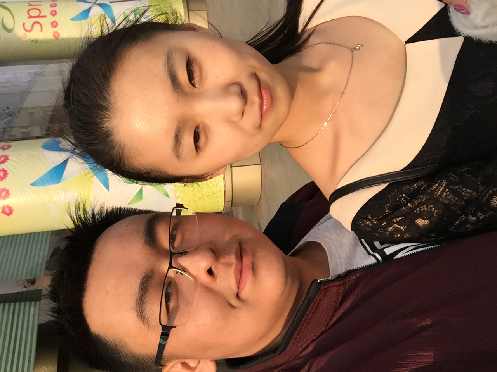

# 2021/11/23

最近繁忙的工作终于在今天的清理之中见到曙光，前一段时间因为各种原因积攒了大量的工作没有进行，今天趁着没有一线问题，顶着难受的感觉把所有拖欠的工作做完了，感觉还不错。

游泳回来的路上，路边的大树刚刚修理过枝叶，所以满地都是落叶和树枝，骑着车子从它们上边碾过去的声音真的非常治愈。

没有孙可之后好像生活的琐碎也变少了，好像想分享的想说的是想记录下来的事情也越来越少了，曾经感觉好像每天会有很多很多有意思的事情想和她分享，但是现在感觉好像生活这么的平淡，有趣的事情也越来越少，每天扑面而来的只有永远的完成不了的工作，不知道什么时候才能到来的转正，看不清的未来，摸不到的梦想，好像没有什么会让人开心舒服的事情。我明白对她来说何尝不是如此？突然生活好像就在逼我们变大，变得把话憋在心里。

每天白天，无时无刻内心不是有无数的想法的看法，总是想用笔记下来，但是到了晚上却觉得大脑空空，回家之后洗衣服做饭吃东西，一晚上就这样一点点被消耗掉，甚至连一句话都不想说，连给自己说一句话都不知道说什么。

渐渐有点明白哥哥的感觉，给家里打电话好像很困难，总需要我憋足勇气和耐心才敢拨过去，因为听到爸爸妈妈的声音我也会不知道说什么怎么面对。曾经大好的未来就这么毁了，不知道要怎么交代。

迷茫吧，好像无比迷茫，突然觉得，自己就像个蜗牛，这个空落落的房子也许就是我的壳

___2016年 3月 28日孙可生日于汉江川韩式烤肉门口___