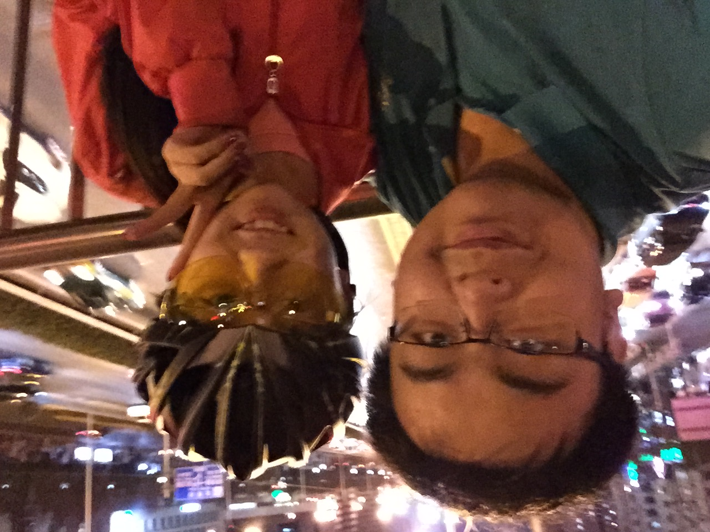

# 2021/11/24

又是一个周三，一周的不前不后，让人觉得漫长而又痛苦。

不知道什么时候开始上班开始变得让人痛苦而难受，今天早上和孙可发微信，她说突然觉得曾经好奢侈，每天都是快乐开心，好像是用不完数不尽的快乐开心。那时候上班虽然痛苦，但是从要下班的前一个小时开始整个人就开始变得开心而又有期待，因为马上就要下班，回家的班车上虽然难熬还总是堵车，但是一想到家里有人在等着我，我们俩可以一起开开心心的吃东西看视频，打游戏，亲亲抱抱然后睡觉，就觉得好幸福好开心，每天都是用不完的开心。

但是现在呢，下班变得程式性，我甚至都不知道下班回家的意义是什么，我都在想其实晚上在办公室将就一晚上也不错，要不是现在的工位附近都是组里的同事，我真的觉得在工位上呆一晚上和回家呆一晚上没什么区别，在公司还不用通勤晚上睡得时间还久。

孙可说的好对呀，现在的快乐变得好奢侈，我已经不是那个可以带给她快乐开心的人，我成了她心里永远的伤疤和痛苦的来源，而我也无颜面对她，生活处处就像一潭死水没有任何活着的气息。

难道真的成年人的快乐就很难吗？曾经明明对我们来说很简单。成年人的生活不难，但是如果像我所做的那样用幼稚的心态搞砸成年人的事，就会很难。不知道怎么就把事情做到这种程度，剥夺了所有人生活的快乐和幸福只为满足自己那点自私无耻的新鲜感的私欲。

今天在听听力的时候，有一个例句就是渣男的行为，我突然心里咯噔一下，好像就是在说我一样，我已经在自己心里给自己打上了渣男的标签，活该，死不足惜。

___2016年 3月 18日骑车在学校北边玩在北四环和小营路交界的天桥上___

