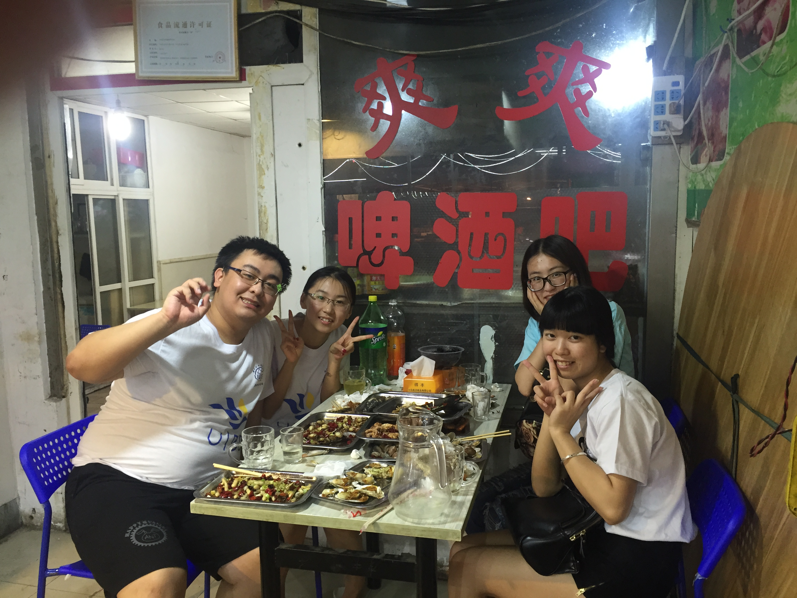

# 2021/11/27

昨天工作上的烦恼笼罩到今天，不过昨天最难过的事情还是被迫在路上定位问题，看手机看的晕头转向，感觉晕车特别的严重。

又是一个月末周六，在这之前我已经连续好几个月末周六都没有好好上班了，上一个周六是帮孙可搬家，再往前的月末周六都是在家陪她，因为一天的周末从来都不够我们俩玩，玩在一起的时候，好像多少时间都不够。

下午去三里屯换手机，来回都是坐地铁，路过了芍药居地铁站，这个月竟然把地铁坐到了打八折的程度。拿到新手机本来以为会很开心，但是那种开心劲好像到家就已经变得索然无味，不论是老手机还是新手机好像都没有想要联系的人都没什么区别。

晚上哥哥过来看我，原来之前他感冒了一周，也没告诉我，我本应去看看他的。

我也不知道写什么今天，就是觉得好累，好像什么都想记录一下，但是又没什么可记录的。

___2016年 7月 1日在青岛和社会实践队员一起吃海鲜___