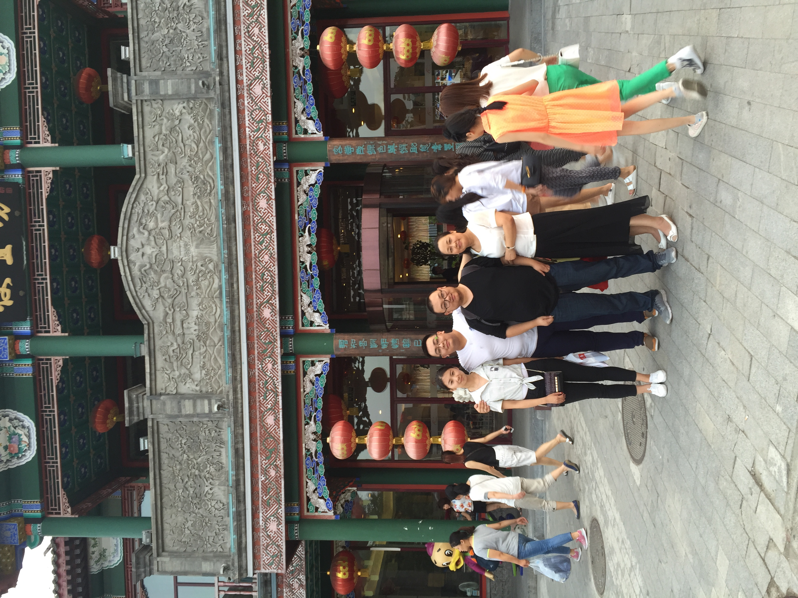

# 2021/11/29

早上醒来看了看气温，今天的温度一直在零上，于是今天就没有穿秋衣。中午去游泳，路上下起了雨，明明今天北京的雨很多，但是这场雨感觉和上一次还是隔了好久，上次还是孙可刚走的第一个周末。

一路上雨打泥土的味道格外的芬芳，沁人心脾，虽然雨打在身上好冷，像刺骨的银针，但是还是让人觉得格外的解压，好希望这样的天气可以孙可出去远行，沿着一个景色优美的小径，慢慢的聊天，漫步，放着轻柔的歌曲。

所有的天气，所有的场景，没有我和孙可没有经历过的，所以无论什么时候在哪里都能回忆起和她的片刻和点滴。回来的路上，两边大树上的叶子被微风吹落，在空着打着旋飘荡，就像一只只蝴蝶。虽然银杏叶的时节早已过去，但是看着这些落叶还是想起来和她一起在学校里踩在银杏叶上的那种温柔。

只是，想起来而已，就这么难过。

晚上和她聊了聊天，心情好多了，她推荐了最近在看的动漫，我决定要看她喜欢的东西，做她喜欢的事，她曾经为我做了那么多，轮到我了，爱她所爱，想她所想，一步步走近她，毕竟现在这是我的最重要的信念。

> 没有日出也没有日落，因为太阳永远停留在同样的地方，只是地球在自己旋转。

___2016年 7月 17日和妈妈哥哥在前门大街便宜坊烤鸭店门口___