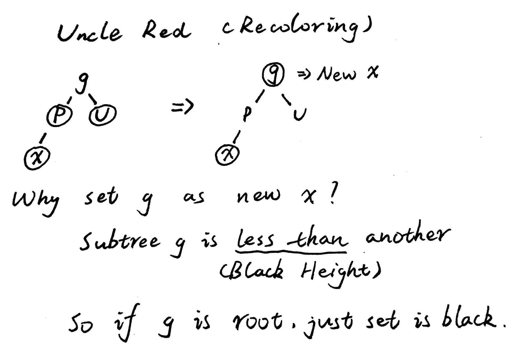
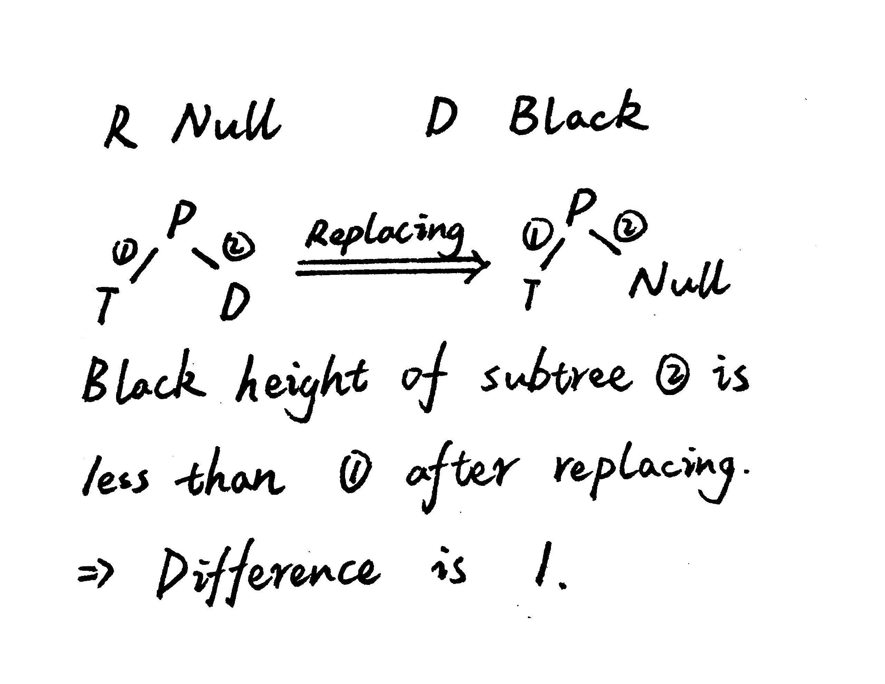
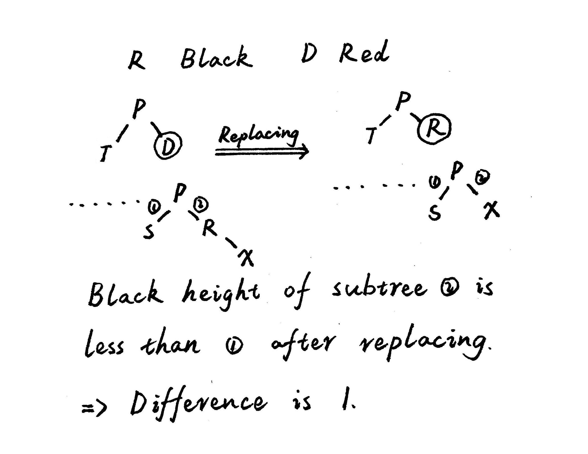

# Red Black Tree
***

## Introduction of Red Black Tree

**[Red Black Tree](https://en.wikipedia.org/wiki/Red%E2%80%93black_tree)** is the most brilliant, ingenious and interesting BST algorithm in my mind. It is a self-balance binary search tree (BST) where every node follows following rules:

1. Every node has a color either red or black
2. Root of tree is always black
3. There is no two adjacent red nodes
4. Every path from a node to its descendant Null node has the same number of black node

**Black Height** is the number of black nodes on the path from root to a leaf.

> A red-black tree of height $h$ has $height\ge\frac{h}{2}$

Every red-black tree with $n$ nodes has $height\le2\log_2(n+1)$

> 1. Let $k$ be the minimum number of nodes on all root to Null paths for a general binary tree
> > $n\ge2^k-1 \Rightarrow k\le\log_2(n+1)$
> 2. For a red-black tree, $k$ is the black height
> > $k\le\log_2(n+1)$
> 3. The number of black nodes at least $\frac{n}{2}$
> > $h\le2\log_2(n+1)$

***
## Red Black Tree Insertion

In order to satisfy the four properties of red-black tree, we must balance the tree after **insertion** and **deletion** caused ___imbalance___. We have two tools to balance the tree:

1. Recoloring
2. Rotation

> 1. Perform a standard BST insertion of $x$ and make the color Red
> 2. If node $x$ is root, change the color of $x$ is black and **break**. Or if color of $x's$ parent is black, **break**.
> 3. We must decide what to do by color of $x's$ uncle:
>     1. Uncle is red, set color of parent and uncle as black, color of grandparent as red, set grandparent as new $x$ then go step 2
> 
>     2. Uncle is black:
>         1. left left
>         2. left right
>         3. right right
>         4. right left
> 

So in three cases we can break from insertion:

1. $x$ is root
2. Color of $x's$ parent is black
3. Rotation

***
## Red Black Tree Deletion

### Standard BST Deletion

Before the discussion of red-black tree deletion, we must review **Standard BST Deletion**.

1. Node to be deleted is leaf
2. Node to be deleted has only one child
3. Node to be deleted has two children $\Rightarrow$ Finding the inordered successor / predecessor

Because the properties of BST make the shadow of BST on the horizontal is just the sorted sequence of BST. So what we find is the nearest node on shadow. 

The nearest node couldn't be a node with two children, because if the node has two children, one of its children must be nearer.

e.g.

So if we want to delete 20, we can choose from 19 and 30. 18 has two children, so one of them must have shorter distance than 18.

### Red Black Tree Deletion

$D$ : The node to be deleted

$R$ : The node which will replace $D$

$X$ : The child of $R$

$S$ : The sibling of $X$

#### Delete and Replace

1. The first step of deletion is perform a standard BST deletion
> $R$ will be recolored as $D$ to keep the black height of $D$ subtree remaining. $X$ will be recolored as $R$ to make sure the black height of $R$ subtree remain.
    1. So if $R$ is red, no matter what case $X$ is, the loss of $R$ will not motify the black height of $R$ subtree only needing to use any one of its original child or Null node to replace $R$.
    2. If $R$ is Null node and $D$ is red, don't need to consider black height of $R$ subtree. Because in this case $D$ must be leaf, just replacing is okey.

This table shows all the cases of $D$ and $R$. Break means that deletion completed and $X$ means that we have to execute next step with $X$ for imbalance.

|   Color   | $D$ Black | $D$ Red |
|:---------:|:---------:|:-------:|
| $R$ Black |    $X$    |   $X$   |
|  $R$ Red  |   Break   |  Break  |
|  $R$ Null |    $X$    |  Break  |

But what will happen after replacing?

1. $R$ Null $D$ Black

2. $R$ Black $D$ Black

3. $R$ Black $D$ Red

In these cases, replacing leads to a partial imbalanced subtree so our target is balancing this subtree. We call the partial imbalanced trees as min imbalanced trees of red-black tree.

**Min Imbalanced Tree** is the minimum subtree of red-black tree which is imbalanced. Balancing the whole tree is just balancing Min Imbalanced Tree.

The possible value of $X$ is black/red/Null. But the possible value of $S$ is what? We know before BST Deletion the tree is balancd, so:

1. $R$ Null $D$ Black

    $T$ is sibling after replaceing. For $D$ is black sibling is red/black.

2. $R$ Black $D$ Black

    $R$ is black so $S$ is red/black.

3. $R$ Black $D$ Red

    $R$ is black so $S$ is red/black.

So color of sibling is only red/black.

|   Color   | $S$ Black | $S$ Red |
|:---------:|:---------:|:-------:|
| $X$ Black |   Case 1  |  Case 2 |
|  $X$ Red  |   Case 3  |  Case 4 |
|  $X$ Null |   Case 5  |  Case 6 |

Our target is balancing min imbalanced tree but how to?

1. $Subtree 1 - 1$
2. $Subtree 2 + 1$

But except $Subtree P$, there is other subtrees, e.g.

If we use method 1, $Subtree 1 = Subtree 2 < Subtree 3 = Subtree 4$ and it isn't balanced yet. So method 1 is wrong? No. Because after using method, $Subtree G$ has become new min imbalanced tree and we set $P$ as new $X$ then repeat the above step until $P$ is root. When $P$ is root there is no other subtree and the whole tree is balanced.

If we use method 2, $Subtree 1 = Subtree 2 = Subtree 3 = Subtree 4$ and the whole tree has been balanced.

#### Balance

Before discussing each ease in balancing, there is another question need to be consider. What operations will lead to method 1 and what operations will lead to method 2？

1. Recoloring
	1. Black $\Rightarrow$ Red: Method 1
    2. Red $\Rightarrow$ Black: Method 2

2. Rotation

If all nodes are black, $Subtree 1 - 1$ and $Subtree 2 + 1$ after rotation. So we have to decide the strategy to take according to the specific case.

